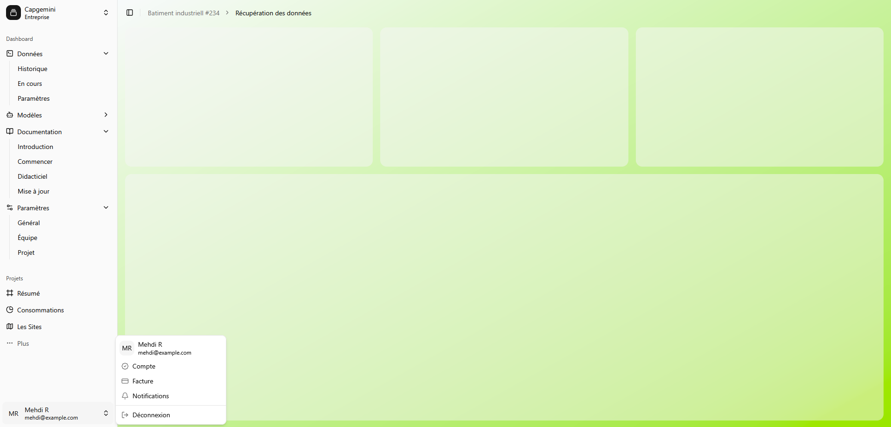

# FrontPage

Une page de connexion moderne et réactive, construite avec des composants d’interface utilisateur avancés et des validations côté client.
Un dashboard simple a également été ajouté après la connexion, pour simuler une navigation authentifiée.

**La page est accessible temporairement via un lien ngrok : https://10377b010d76.ngrok-free.app**

Lien figma de la login page : https://www.figma.com/proto/VJKLkFvL1RfWnd9AsYhM8c/Login_Page?node-id=5-2469&t=KItsUqC57jeZSdtp-1&scaling=contain&content-scaling=fixed&page-id=0%3A1

Lien figma du dashboard : https://www.figma.com/proto/VJKLkFvL1RfWnd9AsYhM8c/Login_Page?node-id=5-2468&t=wHqwa8JLWpPxkStn-1&scaling=contain&content-scaling=fixed&page-id=2%3A27




## Fonctionnalités :

- **Connexion via e-mail et mot de passe**
- **Connexion avec Google** (simple redirection vers le site de google partie front)
- **Validation de mot de passe et e-mail** avec une **regex**
- **Case à cocher** obligatoire pour accepter les **conditions d'utilisation**
- **Dashboard** minimaliste accessible après authentification
- Interface construite avec la librairie **[shadcn/ui](https://ui.shadcn.com)**

## Technologies utilisées :

- **React**
- **shadcn/ui** pour les composants d’interface (`Card`, `Input`, `Button`, etc.)
- **Tailwind CSS** pour le style
- **Lucide Icons** pour les icônes

## Pour lancer :

```bash
git clone https://github.com/AkioLua/Login_Page.git
cd Login_Page
npm install
npm run dev
```

go to -> http://localhost:5173/
